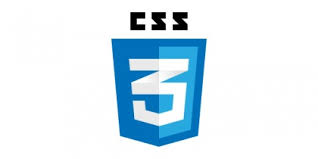

# O que é CSS

É uma linguagem utilizada para definir a apresentação (aparência) da sua aplicação, ela define como serão exibidos os elementos contidos no código de um documento e sua maior vantagem é efetuar a separação entre o formato e o conteúdo de um documento.

Em outras palavras, é através do CSS que você irá dá vida as suas aplicações, é na folha de estilo (CSS) que você define cores para os textos e para os fundos das caixas (blocos), os tamanhos dos textos, o alinhamento do conteúdo, é aqui que você define as animações e quão bonita e apresentável sua aplicação será apresentada ao usuário final, resumindo: CSS é 💜

## Então vamos iniciar adicionando amor na nossa aplicação!!!

A primeira coisa que temos que fazer é dizer pra nossa aplicação qual o documento CSS ela irá utilizar.

Para que isso aconteça adicione a linha de código abaixo dentro da tag `head` logo após a tag `link`.

```HTML
  <link rel='stylesheet' href='main.css'>
```

Ok, nossa aplicação já sabe que irá utilizar o conteúdo do arquivo `main.css`, para apresentar um estilo agradável ao usuário, porém esse arquivo ainda não existe, então vamos criar um arquivo `main.css`

## Então vamos trabalhar no nosso CSS de fato.

Simboraaaa, mas antes de colocar a mão na massa aqui, preciso esclarecer um conceito que aplicamos no html e eu guardei pra falar quando realmente fizesse sentido, tipo agora 😍

No nosso arquivo `index.html`, dentro de cada tag `div` de abertura, adicionamos uma palavrinha chamada `class`.

Acontece que nas nossas tags podemos adicionar vários atributos que são basicamente informações que repassamos para nossa tag solicitando para que elas se comportem conforme esperado.

Por exemplo, `class` é um atributo que recebe um valor representando o estilo que será apresentado para aquela tag.

E o que isso tem a ver com CSS??? TUDOOOOOOO..

Cada palavrinha repassada para o atributo `class` é chamada de valor do atributo, e como a `class` representa o atributo de estilo da nossa aplicação, isso quer dizer que se usarmos esses valores no nosso arquivo `main.css`, para podermos manipular a apresentação do nosso conteúdo, ou seja, podemos usar esses valores (palavrinhas) pra especifar as cores, tamanhos, estilos dos elementos...

É importante falar que o atributo `class` é um atributo padrão que aplica estilos ao elemento, já o seu valor podemos dá o nome que preferirmos, porém é muito importante que esse nome faça sentido com o que o bloco em específico realmente representa na sua aplicação.

Então vamossss iniciar colocando a mão na massa:

Vamos começar pelo começo, rsrrssr, primeiro vamos definir uma altura para as tags `html` e `body`.

Esse trecho de código abaixo faz exatamente isso, adicione ele ao seu arquivo `main.css`

```CSS
html, body {
  height: 100%;
}
```

Para nossa primeira class apresentada, dei nome de `container`, se você reparar todas as outras tags estão embutidas dentro dela, por isso escolhi esse nome container.

Vamos definir como esperamos que esse bloco que contém todos os outros blocos dentro dele se comportem, à partir daqui, copie cada trecho de código que representa uma classe e cole no arquivo `main.css`, procure sempre dá uma quebra de linha entre cada classe.

## `.container{}`

```CSS
.container {
  background: #443266;
  height: 100%;
  width: 100%;
  font-size: 2rem;
  font-family: 'helvetica neue';
  display: flex;
  align-items: center;
  justify-content: center;
}
```

Dentro de `container` passamos algumas propriedades que recebem os valores definidos por nós, nesse formato: `propridade: valor`.

Vamos tentar explicá-las aqui:

* `background` define uma cor para o fundo do nosso container.
* `height` e `width` define uma altura e uma largura respectivamente.
* `font-size` e `font-family` define o tamanho e tipo de fonte.
* `display`, `align-items` e `justify-content` são prorpiedades que estamos utilizando para definir o alinhamento do conteúdo que está dentro do nosso container.

---

## `.clock{}`

```CSS
.clock {
  height: 30rem;
  width: 30rem;
  border-radius: 50%;
  border: 20px solid white;
  margin: 50px auto;
  position: relative;
  padding: 2rem;
  box-shadow: 0 0 0 4px rgba(0, 0, 0, .1),
              inset 0 0 0 3px #efefef,
              inset 0 0 0 10px #C3C3E5,
              0 0 10px rgba(0, 0, 0, .2);
}
```

Nessa classe iremos definir o círculo do nosso relógio, vamos entender o que estamos definindo:

> Obs. Aqui só vamos detalhar os elementos que ainda não explicamos acima, para todas as outras classes iremos seguir esse mesmo padrão.

* `border-radius` essa propriedade é o que dá o efeito de círculo ao nosso relógio.
* `border` aqui adicionamos uma borda para nosso círculo, essa propriedade recebe três valores: a primeira representa a espessura da borda, a segunda representa o tipo da borda e a última representa a cor da borda.
* `position` agora definimos um tipo de posição para o nosso círculo, onde seu valor `relative` faz com que qualquer um de seus filhos que possuam `position: absoluta`, sejam relativos apenas ao círculo e não com toda a página da aplicação.
* `padding` serve pra especificar o espaço interno entre as bordas do círculo e o seu conteúdo.
* `box-shadow` aqui estamos adicionando várias sombras na parte interna do círculo.

---

## `.clock-back{}`

```CSS
.clock-back{
  position: relative;
  width: 100%;
  height: 100%;
}
```

Essa classe representa a parte interna do nosso relógio, não iremos nos aprofundar nas propriedades porque elas já foram explicadas nas outras classes acima.

---

## `.pointer{}`

```CSS
.pointer{
  width: 50%;
  height: 2%;
  background: #C3C3E5;
  position: absolute;
  top: 50%;
  transform-origin: 100%;
  transform: rotate(90deg);
  transition: all .05s;
  transition-timing-function: cubic-bezier(.1, 2.7, .58, 1);
}
```

Aqui vamos definir o estilo para os ponteiros de minutos, segundos e horas. Vamos começar a falar a partir da 4ª propriedade, já falamos dela em alguma classe acima, porém aqui ela recebe um valor diferente.

* `position: absolute` agora nossos ponteiros tem posição absoluta em relação ao círculo.
* `top` definimos uma distância do topo do círculo.
* as últimas quatros propriedades estão relacionadas à rotação aplicadas ao ponteiro e que vamos manipluar alguns de seus valores na próxima etapa usando o [JS](js.md)

[🔙 Starting](starting.md)
