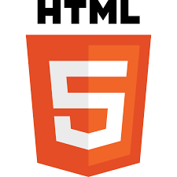
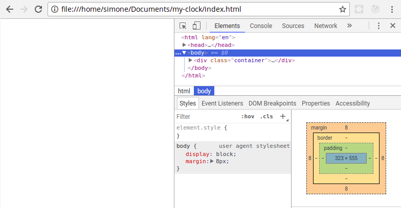

# O que é HTML

É uma linguagem de marcação que além de ser responsável por exibir a informação ela dá significado aos dados que são exibidos na tela.

As informações são marcadas através de tags que são envolvidas por um sinal de `<` e `>`, no nosso clock iremos usar uma única tag que é chamada de `div`.

O nome da tag `<div>` vem de divisão, ela é uma caixa genérica que não representa nada e pode ser usada para agrupar elementos.

## Criando a estrutura básica

* Crie uma pasta na sua área de trabalho chamada `my-clock`
* Abra o seu editor de código, no meu caso estou usando o [vscode](https://code.visualstudio.com/)
* Clique em `file > open folder` e selecione a pasta `my-clock` que você criou na área de trabalho
* Crie um novo arquivo `file > new file` e salve como `index.html`
* Nesse novo arquivo digite `doc` e tecle `enter`
* Prontinho, foi gerado `automagicamente` uma estrutura básica pra iniciarmos nosso trabalho 😍

```HTML
<html lang="en">

  <head>
    <meta charset="UTF-8">
    <meta name="viewport" content="width=device-width, initial-scale=1.0">
    <meta http-equiv="X-UA-Compatible" content="ie=edge">
    <title>Document</title>
  </head>

  <body>

  </body>

</html>
```

Observe a tag `title`, ela irá exibir o título da página, altere o texto `Document` por `My Clock`.

Agora pra ficar mais completo vamos adicionar o código abaixo na primeira linha do nosso arquivo index.html. Ele serve para avisar ao navegador qual o tipo de conteúdo ele irá carregar na tela.

```HTML
<!DOCTYPE html>
```

> Obs.: Para quem ainda está a na fase de início de aprendizado, esta não é melhor forma de começar uma aplicação, só estou usando essa abordagem devido ao nosso tempo.

Copie o código abaixo e cole na próxima linha após a tag `body`

```HTML
<div class='container'>
    <div class='clock'>
      <div class='clock-back'>
        <div class='pointer' data-js='pointerHour'></div>
        <div class='pointer' data-js='pointerMin'></div>
        <div class='pointer' data-js='pointerSec'></div>
      </div>
    </div>
  </div>
```

Agora você pode ir na pasta `my-clock` que você criou na área de trabalho e abrir o arquivo `index.html`, clique com o segundo botão do mouse na página que você abriu e selecione `inspect`, vai abrir uma pequena janela, ela se chama inspetor de elementos, nela podemos visualizar os códigos que produzimos.

Se você selecionar a tag `body` poderá visualizar que ela possue uma `margem de 8px`, mas assim, nós não adicionamos nenhuma margem ainda, de onde ela veio?

Isso significa que cada navegador tem seu próprio estilo para algumas tags específicas, o que acaba gerando compartamentos diferentes na sua aplicação dependendo do navegador que o usuário abrir.



Para resolver isso podemos adicionar o link abaixo dentro da tag `head`, que nada mais é que um link para um arquivo com alguns códigos, que aplicam o reset em algumas propriedades CSS que possuem formatação padrão, iniciando sua aplicação sem nehum estilo predefinido, então sua aplicação fica pronta pra receber apenas o estilo que você definir no seu arquivo `.css`

```HTML
<link rel='stylesheet' href='https://cdnjs.cloudflare.com/ajax/libs/normalize/5.0.0/normalize.min.css'>
```

> Vou deixar aqui pra vocês o link abaixo que aponta pra um ótimo artigo, explicando detalhadamente sobre `HTML`

* [O básico: O que é HTML?](https://tableless.com.br/o-que-html-basico/)

Então podemos trabalhar na nossa [CSS](css.md), e só assim vamos conseguir visualizar o que fizemos até agora.

[🔙 Starting](starting.md)
