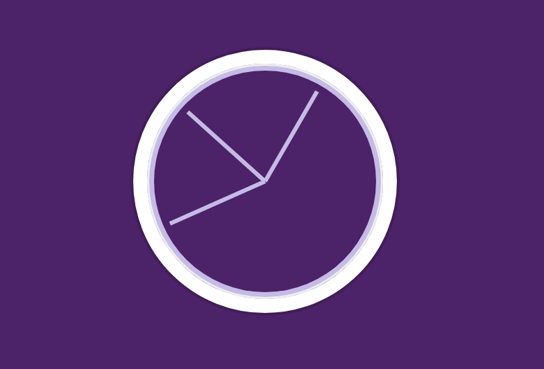

# O que vamos fazer hoje?

## Como vamos criar nosso clock?

Iremos utilizar as três tecnologias básicas - `HTML + CSS + JS` - para criar nossa página web que conterá um relógio.

No universo web, cada uma dessas tecnologias tem suas próprias responsabilidades, falando de uma forma simples, usamos o `HTML` para exibir as informações na tela, o `CSS` é o que vai dá vida ao nosso relógio, é o que vai deixá-lo bonitinho e o `JS` irá ser responsável pelo comportamento do nosso relógio, o que no nosso caso será responsável por criar a ação dos ponteiros ficarem girando de acordo com o horário da máquina.

## Acesse os links na ordem que segue abaixo e vamos começar?

* [HTML](html.md)
* [CSS](css.md)
* [JS](js.md)

## Links importantes:

* [Primeiros passos na web](https://github.com/VaiNaWeb/primeiros-passos-na-web)
* [WES BOSS - Courses](http://wesbos.com/courses/)
* [Do Zero a Herói Front-End (Parte I)](https://www.felipefialho.com/blog/2016/do-zero-a-heroi-do-front-end-parte-1)
* [Git e Github para iniciantes](https://www.udemy.com/git-e-github-para-iniciantes/learn/v4/overview)
