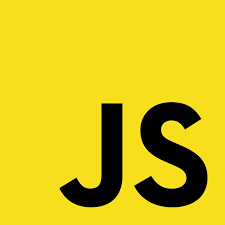

# O que é Java Script?

JavaScript não é Java, essa é a primeira coisa que você precisa saber: JavaScript não tem nada a ver com Java.

Java é uma linguagem que roda do lado do servido, já java Script roda em ambos os lados: cliente e servidor(Node.js).

Através do Java Script, que daqui pra frente irei chamar carinhosamente de JS, é possível controlar o `HTML` e o `CSS` para manipular o comportamento das nossas páginas.

## Vamos entender melhor na prática.

### Linkando nosso HTML com o nosso JS

Primeiro vamos informar para o nosso `HTML`, qual o arquivo que ele deve considerar para definir o comportamento da nossa aplicação. Copie o trecho de código abaixo e cole após a última tag `div` do seu arquivo `index.html`.

```HTML
<script src='main.js'></script>
```

Agora teremos que criar o arquivo main.js para que possamos usá-lo na manipulação dos dados da nossa aplicação.

### Usando o atributo data-\* para adicionar informações extras

Assim como usamos um atributo para manipular o CSS, também adicionamos outro atributo após o `class`, lá dentro de algumas das nossas tags `div` do arquivo `index.html`.

Podemos usar o atributo `data-*` para armazenar informações extras e manipular o comportamento da nossa aplicação através do `JS`

### Pensando juntos na solução do problema

Vamos pensar juntos, o que realmente precisamos manipular nessa aplicação?  
Isso precisamos manipular os ponteiros, e mandar eles ficarem girando conforme a hora atual.

Pensa junto comigo, pra manipular os ponteiros eu vou precisar saber quem é cada ponteiro, por esse motivo coloquei o atributo `data-js` com a informação pra cada ponteiro.

### Retornando os dados do HTML

Agora vamos buscar essa div lá do `HTML` para trabalharmos nela aqui no `JS`. Basicamente o que precisamos é definir uma variável, que nada mais é que um nome simbólico para guardar os valores em sua aplicação.

Apoś criarmos a variável, precisamos atribuir a ela, o código que irá retornar as informações da tag que tem o atributo especificado, tente entender no código abaixo, depois copie e cole no arquivo `main,js`:

```JS
let $pointerHour = document.querySelector('[data-js="pointerHour"]');

console.log($pointerHour)
```

O método `console.log()` existe para retornar na aba console do navegador,o valor que for repassado pra ele dentro dos parênteses. Dá uma olhadinha lá na aba console do inspetor de elemento do teu navegador.

Massa, retornamos a div que tem os dados das horas, agora precisamos retornar as divs com os dados dos minutos e segundos. Tente fazer isso sozinho.

Depois que consluir, teste se os novos valores estão realmente retornando,caso positivo apague o console.log.

### Criando uma função para manipular os ponteiros

Função em JS são blocos que possuem intruções, e que devem ser executadas no momento em que a função for chamada. Criamos uma função usando este formato: `function nomeDaFuncao() {}` e chamamos a função para ser executada usando esse formato: `nomeDaFuncao()`.

Existem algumas funções já predefinidas que podemos utilizá-las, por exemplo, na nossa aplicação vamos usar a função `setInterval(nomeDaFuncao, 1000)`, o que essa função faz é executar o que estiver definido no primeiro parâmetro, no intervalo de tempo especificado no segundo parâmetro.

Então vanos criar nossa função e usar a função `setInterval`, depois copie o código abaixo e cole no seu arquivo `main.js`.

```JS
function movePointers() {}

setInterval(movePointer, 1000);
```

### Usando o Objeto Date() para manipular hora/ minuto /segundo

Um objeto é uma coleção de propriedades, e uma propriedade é uma associação entre um nome (ou chave) e um valor. Um valor de propriedade pode ser uma função, que é então considerada um método do objeto.

Dentro da função `movePointers` irá ficar todos os passos para mover os ponteiros do relógio, vamos criar cada tarefa a ser executada aos poucos.

Primeiro vamos usar o `Objeto Date()` do `JS` pra obter os dados data e hora. Veja abaixo como podemos fazer isso, copie e cole o techo de código no seu arquivo `main.js`, e depois confirme o valor retornado na aba console do seu navegador:

```JS
const now = new Date();

console.log(now);
//Sat Mar 24 2018 01:04:13 GMT-0300 (-03)
```

Ótimo, retornou exatamente o que queríamos, agora precisamos retornar o valor atual da hora, segundos e minutos, o Objeto Date() já possui métodos pre-definidos que retornam isso pra nós. Vejamos no exemplo abaixo, logo após cole o código no seu `main.js` e confira na aba console do navegador.

```JS
const seconds = now.getHour();

console.log(seconds);
```

OK, faço o mesmo procedimento para os minutos e segundos, trocando apenas a palavra `Hours` por `Minutes` para retornar os minutes e `Seconds`

### Calcular os graus para rotacionar os ponteiros

```JS
const secondsDegrees = ((seconds/60) * 360) + 90;
$pointerSec.style.transform = `rotate(${secondsDegrees}deg)`

const allPointers = document.querySelectorAll('.pointer')

if(secondsDegrees === 90) {
  allPointers.forEach(pointer => pointer.style.transition = 'none')

} else {
    allPointers.forEach(pointer => pointer.style.transition = '')
  }
```

[🔙 Starting](starting.md)
